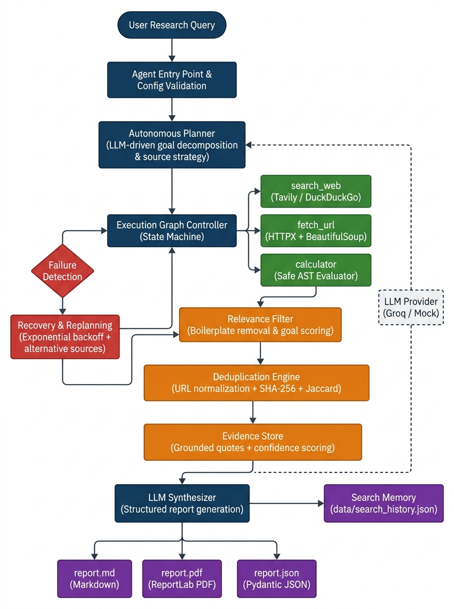

# System Architecture & Technical Specifications

## 1. Architectural Philosophy

The **Autonomous Research & Competitive Intelligence Agent** is designed around a free-first developer philosophy:
> **Deterministic scaffolding handles safety, limits, state tracking, and protocol execution; the LLM handles dynamic reasoning, tool selection, and evidence synthesis.**

Rather than implementing a hardcoded workflow (`search -> fetch -> summarize`), the system implements an explicit, inspectable state machine (`ResearchAgentGraph`) using free-tier services by default (Groq Llama-3.3-70b and Tavily Search).

---

## 2. Architecture Diagram



*Rendered pipeline diagram showing the complete data flow from user query through plan generation, tool execution, quality pipeline, failure recovery, and multi-format artifact export.*

## 3. Mermaid State & Orchestration Diagram

```mermaid
flowchart TD
    %% Autonomous Research Agent Architecture - Assessment Option 1 Pipeline
    subgraph Input_Layer ["Input & Memory Layer"]
        UG["User Research Goal\n(Natural Language)"] --> GV["Input Validator &\nConfig Check"]
        SM[("Search Memory Store\ndata/search_history.json")] <-->|History Check / Store| GV
        GV --> AP["Autonomous Planner\n(Source Selection & Strategy)"]
        AP -->|Structured ResearchPlan| AG["Agent Controller\n(ResearchAgentGraph)"]
    end

    subgraph Tool_Ecosystem ["Pluggable Tool & Gathering Layer"]
        AG -->|Tool Action / Dispatch| TC["Tool Controller\n(Validated Pydantic Schemas)"]
        TC -->|Search Queries| ST["search_web\n(Tavily / DuckDuckGo / Cache)"]
        TC -->|Parallel URLs| PF["parallel_fetch_urls\n(Bounded Async Semaphore)"]
        TC -->|Single URL| FT["fetch_url\n(HTTPX / HTML Cleaning)"]
        TC -->|Arithmetic| CT["calculator\n(Safe AST Math Evaluator)"]
    end

    subgraph LLM_Layer ["LLM Provider Abstraction"]
        AP -.-> LLM["LLM Provider\n(Groq gpt-oss-120b / Mock)"]
        AG -.-> LLM
    end

    subgraph Evidence_Pipeline ["Evidence & Quality Pipeline"]
        ST --> OBS["Raw Observations"]
        PF --> OBS
        FT --> OBS
        CT --> OBS
        
        OBS --> RF["Relevance Filter\n(Boilerplate Removal & Goal Scoring)"]
        RF --> DEDUP["Deduplication Engine\n(URL Normalization & Content Hashing)"]
        DEDUP --> EV_STORE[("Compact Evidence Store\nRanked & Budget-Controlled")]
        
        OBS --> FD{"Tool Failure\nor Timeout?"}
    end

    subgraph Recovery_Layer ["Failure Recovery & Adaptive Replanning"]
        FD -->|Retryable Failure| RC{"Retry Count < Max?"}
        RC -->|Yes| RT["Exponential Backoff\n& Retry Tool"]
        RT --> TC
        RC -->|No (Exceeded)| RP["Autonomous Replanner\n(Alternative Source / Pivot)"]
        RP -->|Updated Steps| AG
    end

    subgraph Synthesis_Layer ["Evidence Grounding & Multi-Format Reporting"]
        FD -->|Success| CHK{"Remaining Steps\nor Budget Left?"}
        CHK -->|Yes| AG
        CHK -->|No| EG["Grounding & Provenance\nCross-Validation Engine"]
        EV_STORE --> EG
        EG --> AS["Autonomous Synthesizer\n(Structured Report Generator)"]
        AS --> SR["Structured ResearchReport\n(Pydantic Model)"]
        SR --> MD["output/report.md\n(Publication Markdown)"]
        SR --> JS["output/report.json\n(Validated JSON Schema)"]
        SR --> PDF["output/report.pdf\n(Publication PDF Report)"]
        SR --> SM
    end
```

---

## 3. Core Architectural Subsystems

### 3.1. Agent State Machine (`app/agent/graph.py` & `app/agent/state.py`)
Execution is governed by the `ResearchAgentGraph` which updates an immutable, fully serializable `AgentState` object:
* `goal`: The natural language objective.
* `plan`: Structured `ResearchPlan` decomposed dynamically by the LLM, including autonomous source strategy and target source types.
* `current_step`: Active `PlanStep` under execution.
* `completed_steps` & `pending_steps`: Explicit task queue.
* `observations`: Chronological register of tool outputs.
* `sources`: Normalized web endpoints with authority classifications and deduplication.
* `evidence`: Verifiable factual claims linked to source URLs, direct quotes, relevance scores, and content hashes.
* `tool_history`: Complete invocation logs with millisecond timings.
* `failures` & `retries`: Explicit audit logs of network or tool exceptions.
* `calculations`: Safe arithmetic metrics calculated during the run.

### 3.2. Provider Abstractions (`app/providers/`)
* **LLM Provider (`app/providers/llm/`):** Defaults to **Groq** via OpenAI-compatible endpoints (`openai/gpt-oss-120b`). Features rate-limit detection with `Retry-After` backoff and compact schema repair. Includes `MockLLMProvider` for zero-cost offline deterministic execution.
* **Search Provider (`app/providers/search/`):** Defaults to **Tavily** (`https://api.tavily.com/search`) with in-memory query caching to preserve free-tier credits. Supports keyless DuckDuckGo Lite as an alternative.

### 3.3. Pluggable Tool Suite & Gathering Layer (`app/tools/` & `app/agent/executor.py`)
Every tool adheres to `BaseTool`, defining strict Pydantic input and output schemas:
1. **`search_web` (`SearchWebTool`)**: Retrieves public web links, titles, snippets, and domains with per-session query caching.
2. **`fetch_url` (`FetchUrlTool`)**: Fetches HTML via `httpx`, removes scripts/styles via `BeautifulSoup`, normalizes text, and truncates at natural sentence boundaries.
3. **`parallel_fetch_urls`**: Bounded concurrent retrieval of multiple candidate URLs using an `asyncio.Semaphore(max_concurrency=4)`, enabling sub-second parallel ingestion.
4. **`calculator` (`SafeCalculator`)**: Evaluates arithmetic expressions using an Abstract Syntax Tree (AST) evaluator without `eval()` or `exec()`.

### 3.4. Relevance Filtering & Quality Pipeline (`app/services/relevance.py`)
Incoming web content is parsed through `RelevanceFilter`:
* Strips navigation elements, cookie notices, subscribe prompts, and social share footers.
* Evaluates keyword density and semantic alignment against the research goal.
* Assigns transparent `relevance_score` and `relevance_reason` metadata to each evidence item. Off-topic and low-quality snippets are rejected before evidence extraction.

### 3.5. Deduplication Engine (`app/services/deduplication.py`)
Multi-stage deduplication ensures zero redundancy:
* **URL Normalization**: Strips tracking parameters (`utm_*`, `ref`, `fbclid`), URL fragments, trailing slashes, and downcases hostnames.
* **Exact Content Hash**: SHA-256 fingerprinting on normalized text blocks rejects identical copy.
* **Near-Duplicate Similarity**: Token-level Jaccard similarity detection identifies syndicated articles and overlapping content across different domains.

### 3.6. Search Memory Store (`app/services/search_memory.py`)
Persistent, lightweight search memory stored in `data/search_history.json`:
* Records timestamped search goals, key points, source domains, and execution metrics.
* Enables similarity lookup across prior research runs to avoid redundant work.

### 3.7. Multi-Format Exporters (`app/services/report_service.py` & `app/services/pdf_export.py`)
Every research run automatically produces three artifacts:
* **Markdown (`output/report.md`)**: Human-readable, professionally formatted report with executive summary, methodology, key points, findings, actionable insights, and grounded citations.
* **JSON (`output/report.json`)**: Machine-readable Pydantic schema including complete execution logs, audit metrics, and source provenance.
* **PDF (`output/report.pdf`)**: Publication-grade PDF document generated via ReportLab Platypus, complete with tables, metadata callouts, and clean typographic hierarchy.

### 3.8. Failure Recovery & Adaptive Replanning (`app/agent/recovery.py`)
When a tool invocation fails (e.g. simulated timeout or remote HTTP 500):
1. **Immediate Retry Phase**: Retries the action up to `MAX_RETRIES_PER_TOOL` (default: 2) with backoff.
2. **Replanning Phase**: If retries are exhausted, the failure context is evaluated by `AutonomousReplanner`, which dynamically introduces fallback search steps or alternative documentation mirrors.

### 3.9. Evidence Grounding & Explainable Confidence (`app/services/evidence_service.py`)
Confidence is calculated deterministically via a multi-factor weighting formula:
$$\text{Confidence} = (A \times 0.40) + (D \times 0.35) + (I \times 0.25) - P_{\text{conflict}}$$
* $A$ (**Source Authority**): 0.40–0.95 based on domain tier.
* $D$ (**Evidence Directness**): 0.95 for verbatim textual quotes, 0.75 for summarized claims.
* $I$ (**Independent Sources**): 0.65–0.95 depending on corroboration across distinct domains.
* $P_{\text{conflict}}$ (**Conflict Penalty**): 0.15 deduction if contradictory claims exist between sources.

---

## 4. Security & Safety Defenses
* **Untrusted Web Data Separation**: Web content is treated strictly as passive data inside labeled delimitations (`EXTERNAL SOURCE CONTENT`), never as execution instructions.
* **AST Mathematical Sandbox**: Code execution is prohibited; the calculator only accepts binary arithmetic AST operators (`+`, `-`, `*`, `/`, `%`, `**`).
* **Secret Redaction**: Structured JSON logging automatically intercepts and masks API tokens and authorization headers.
